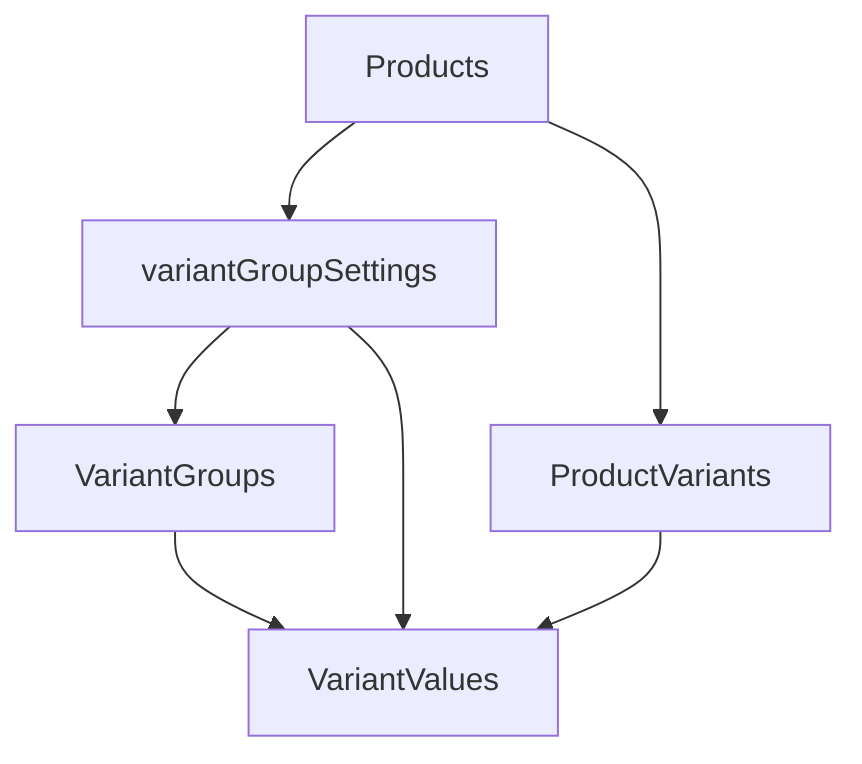

# Variant system

ReviewCartDeals uses a flexible variant model for products with selectable options (color, size, etc.).

## Entities

| Collection           | Purpose                                                            |
| -------------------- | ------------------------------------------------------------------ |
| **Variant Groups**   | Defines option types (e.g. Color, Size)                            |
| **Variant Values**   | Values within a group (e.g. Gold, Silver)                          |
| **Products**         | `enableVariants`, `variantGroupSettings`, optional value galleries |
| **Product Variants** | Generated combinations linked to a product                         |

## Admin workflow

1. Create **Variant Groups** and **Variant Values** in Payload admin.
2. Edit a product → enable variants → configure which groups/values apply.
3. Use **Generate Variants** to create `product-variants` rows from combinations.
4. Publish the product and variants when ready for the storefront.

## Storefront behavior

- Products with variants require option selection before adding to enquiry.
- `AddToCartButton` links to the product page when variants are enabled but none selected.
- Variant labels appear in the cart enquiry WhatsApp message.

## Validation

[`variantValidation.ts`](../src/lib/variantValidation.ts) enforces:

- Allowed values match product group settings
- Complete option rows before publish
- Consistent combination keys across variants

## Notes

- Do not squash migrations until production DB strategy is confirmed.
- Variant generation is available via admin UI and `POST /api/products/:id/generate-variants`.
